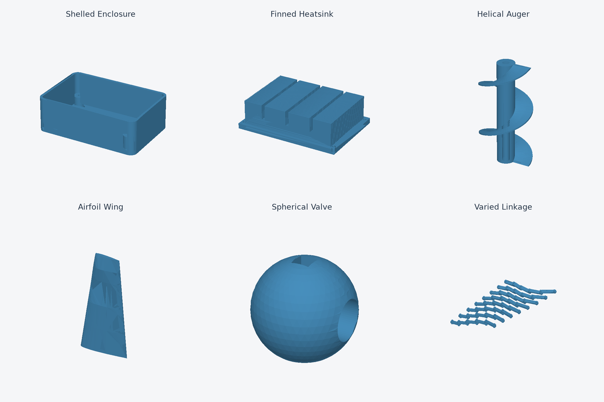

Additional model fixtures
=========================

Each Python fixture is a standalone Steve input with a top-level ``result``.
Copy its contents into a Steve model to inspect or change its dimensions.

Start with ``blocky.py`` for feature history, ``perforated_panel.py`` for many
cuts, ``airfoil_wing.py`` for freeform surfaces, and ``colored_rack.py`` or
``varied_linkage.py`` for assembly/viewer stress. All fixtures are included in
the same preview/full suite; none of these suggestions excludes other workloads.

``blocky.py`` is the user's supplied model, unchanged: a rounded and chamfered
block, counterbore, four countersinks, and six separate engraved-letter cuts.
It exercises Steve's Model history and references alongside CadQuery text and
selectors. Keep its sequence intact when comparing performance.

The first five additional fixtures were created for this investigation:

* ``perforated_panel.py``: 225 holes and rounded corners; large topology and
  repeated boolean operations.
* ``lofted_duct.py``: a thin curved wall between two lofts, transitioning from
  circular to elliptical cross-sections.
* ``swept_tube.py``: a hollow spline sweep.
* ``grooved_pulley.py``: a revolved profile with two belt grooves and a keyway.
* ``colored_rack.py``: 200 colored component instances in ten nested assemblies.

Six more generated fixtures extend coverage without changing those originals:

* ``shelled_enclosure.py``: a rounded offset shell with four internal bosses and
  blind mounting holes.
* ``finned_heatsink.py``: 32 thin fins, three cross-slots and four mounting holes;
  many planar faces and a large union followed by cuts.
* ``helical_auger.py``: a two-turn twisted blade fused to a bored shaft.
* ``airfoil_wing.py``: five periodic spline profiles lofted into a tapered,
  swept wing with washout.
* ``spherical_valve.py``: spherical trimming with intersecting angled ports,
  a square stem socket and a bottom flat.
* ``varied_linkage.py``: 120 parts across 40 nested joints and eight chains,
  mixing separately built links, shared pins, colors and rotations about two axes.

These are deterministic synthetic workloads, not externally sourced designs or
engineering-qualified parts. They cover modeling paths absent from the first set;
they must not be substituted for slower cases when computing the original score.

``../render_models.py`` renders the six additions as a static catalog using
their actual tessellations. Run it separately from performance measurements.

The runtime suite also loads twelve models from Steve's examples: plate,
bearing pedestal, design, housing, flange, impeller, sheet-metal bracket,
return-lip tray, sheet-metal enclosure, turbine stage, planetary gearset and
turbo rotor. The last two include their original component and parameter files.

Each of these twenty-four models has preview and full-build cases. Runtime checks
require valid solid geometry, completed viewer topology, the expected exports,
no failed top-level modeling features, and verified history replay for full
part builds. Design builds use Steve's existing assembly checks. Timing
comparisons additionally compare geometry metadata between versions.

Current reliability checkpoint
-----------------------------

The CadQuery stateful-workflow candidate completes all 48 matched requests with
**1.782x** overall speedup against original Steve, **1.540x** for preview and
**2.061x** for full builds. Every case median improves, geometry checks match,
and the separate export audits match the preceding validated package. The
fixtures, including the user's BLOCKY sequence, are unchanged.
See ``../ROBUSTNESS.rst`` and the local
``../results/api-stateful-installed-runtime-summary.{rst,json,png}`` reports.

This run uses compiled Steve modules with production preimports, and times
run_request itself, excluding fixture setup, independent assertions and cleanup.
It retains the approximately 1.7x reference; the original broad 2x target
has not been reached.
